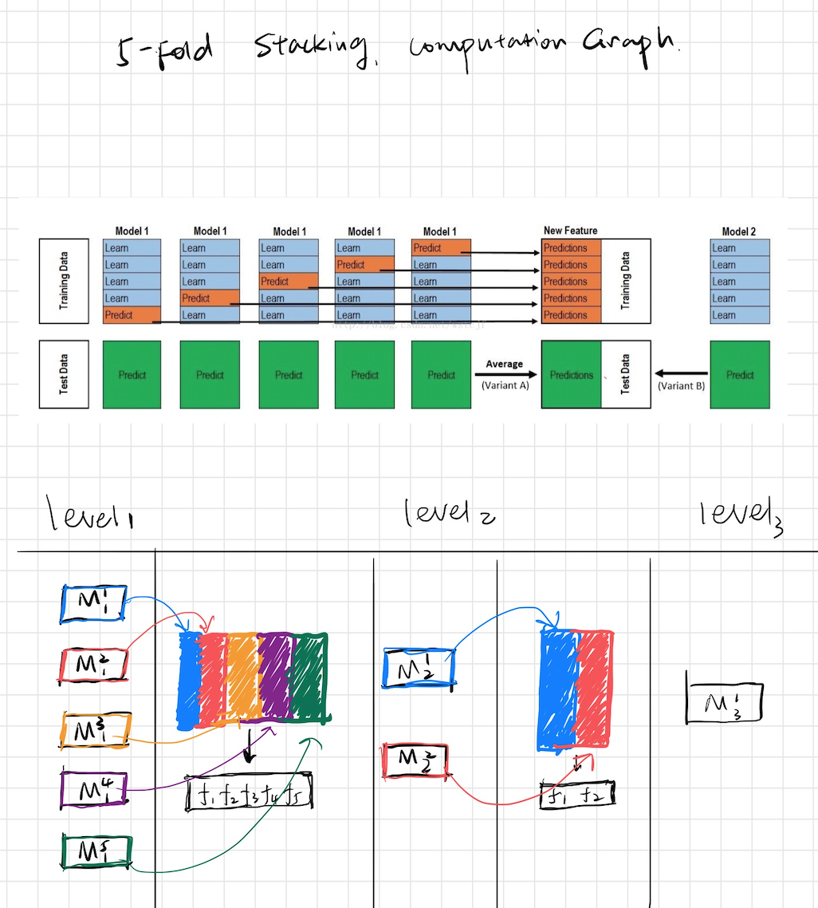

# SKNet

## Introduction
SKNet is a new type of neural network that is simple in structure but complex in neuron. Each of its neuron is a traditional estimator such as SVM, RF, etc.  

## Fetaures 
We think that such a network has many applicable scenarios. For example: 
- We don't have enough samples to train neural networks. 
- We hope to improve the accuracy of the model by means of emsemble. 
- We hope to learn some new features. 
- We want to save a lot of parameter-tuning time while getting a stable and good model.


## Installation

```python3
pip install sknet
```


## Example

## Computation Graph



### Code

```python
from sknet.sequential import Layer,Sequential,SKNeuron

from sklearn.ensemble import RandomForestRegressor
from sklearn.ensemble import AdaBoostRegressor
from sklearn.ensemble import ExtraTreesRegressor
from sklearn.svm import LinearSVR
from sklearn.linear_model import LogisticRegression
from sklearn.ensemble import GradientBoostingRegressor
from sklearn.neighbors import KNeighborsRegressor


from sklearn.datasets import load_breast_cancer
from sklearn.model_selection import train_test_split


data = load_breast_cancer()
features = data.data
target = data.target

X_train, X_test, y_train, y_test = train_test_split(features, target, test_size=0.2, random_state=42)


layer1 = Layer([
    SKNeuron(RandomForestRegressor,params = {"random_state": 0}),
    SKNeuron(GradientBoostingRegressor,params = {"random_state": 0}),
    SKNeuron(AdaBoostRegressor,params = {"random_state": 0}),
    SKNeuron(KNeighborsRegressor),
    SKNeuron(ExtraTreesRegressor,params = {"random_state": 0}),
])

layer2 = Layer([
    SKNeuron(AdaBoostRegressor,params = {"random_state": 0}),
    SKNeuron(LinearSVR,params = {"random_state": 0}),
])

layer3 = Layer([
    SKNeuron(LogisticRegression,params = {"random_state": 0}),
])


model = Sequential([layer1,layer2,layer3],n_splits = 5)
y_pred = model.fit_predict(X_train,y_train, X_test)
print(model.score(y_test,y_pred))


# acc = 0.9736842105263158
```

## How to construct the SkNet

## General Considerations（不用严格遵守）
1. introduce more information on first level
2. use simpler model for Subquent level

## How to introduce more information?
1. use different estimator
2. use same estimator but differences parameters(such as random seed, ...)
3. simpling samples
4. simpleing features
5. different feature engineering techniques (one-hot, embedding, ...)

### first level Tips
1. Diversity based on algo
    - 2-3 gradient boosted trees(xgboost, H2O, catboost)
    - 2-3 Neural Net (keras, pyTorch)
    - 1-2 ExtraTree/ Random Forest( sklearn)
    - 1-2 Linear models as in Logistic/ridge regression, linearsvm(sklearn)
    - 1-2 knn models(sklearn)
    - 1 Factorization machine (libfm)
    - 1 svm with nonlinear kernel if size/memory allows(sklearn)
    - 1 svm with nonlinear kernel if size/memory allows(sklearn)
2. Diversity based on input data
    - Categorical features: One hot, label encoding, target encoding, frequency.
    - Numberical features: outliner, binning, derivatives, percentiles, scaling
    - Interactions: col1 \*/+-col2, groupby, unsupervied
    - For classification target, we can use regression models in middle level 

### Subquent level tips
1. Simpler(or shallower) algo
    - gradient boosted tree with small depth(2 or 3)
    - linear models with high reglarization
    - Extra Trees
    - Shallow network
    - Knn with BrayCurtis Distance
    - Brute forcing a seach for best linear weights based on cv
2. Feature engineering
    - parwise differences between meta features
    - row-wise statics like average or stds
    - Standard feature selection techniques


## Todo
- Two or three level stacking
- multi-processing
- features proxy


